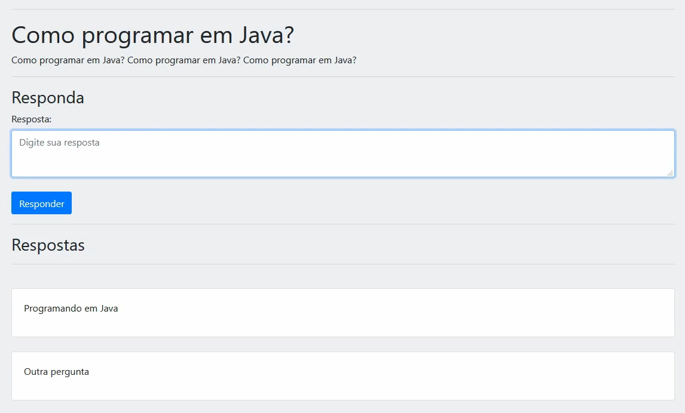

# Plataforma de perguntas e respostas

Este projeto implementa uma plataforma de perguntas e respostas com Node, Express e MySQL.

## Interface

<div align="center">
  
</div>

## Sumário

- [Tecnologias Utilizadas](#tecnologias-utilizadas)
- [Status](#status)
- [Descrição](#descrição)
- [Funcionalidades](#funcionalidades)
- [Explicação](#explicação)
- [Como Usar](#como-usar)
- [Autor](#autor)

## Tecnologias Utilizadas

<div style="display: flex; flex-direction: row;">
  <div style="margin-right: 20px; display: flex; justify-content: flex-start;">
    
  </div>
  <div style="margin-right: 20px; display: flex; justify-content: flex-start;">
    
  </div>
  <div style="margin-right: 20px; display: flex; justify-content: flex-start;">
    
  </div>
</div>

## Status


## Descrição

É possivel responder uma pergunta e também ver as outras perguntas que foram relizadas.

## Funcionalidades

Responder perguntas, consultar respostas e realizar as próprias perguntas.

<div align="center">
  
</div>

## Explicação

O código funciona basicamente no Backend, possuindo uma interface básica em EJS que é manipulado por rotas no Express.


## Como Usar

1. Clone o Repositório
Clone o repositório do projeto para o seu ambiente local:

git clone https://github.com/repositorio

2. Navegue até o Diretório do Projeto
Use o terminal para navegar até o diretório do projeto.

3. Instale as Dependências
   
Execute o comando abaixo para instalar todas as dependências listadas no arquivo package.json:

```
npm install
```

Este comando criará a pasta node_modules e instalará todas as dependências necessárias.

4. Instale Dependências Individualmente (Opcional)

Se preferir, você pode instalar cada dependência individualmente usando os seguintes comandos:

```
npm install body-parser@^1.19.0
```

EJS

```
npm install ejs@^2.7.1
```

express

```
npm install express@^4.17.1
```

mysql2

```
npm install mysql2@^1.7.0
```

sequelize


```
npm install sequelize@^5.19.1
```

## Autor

Desenvolvido por Diego Franco
