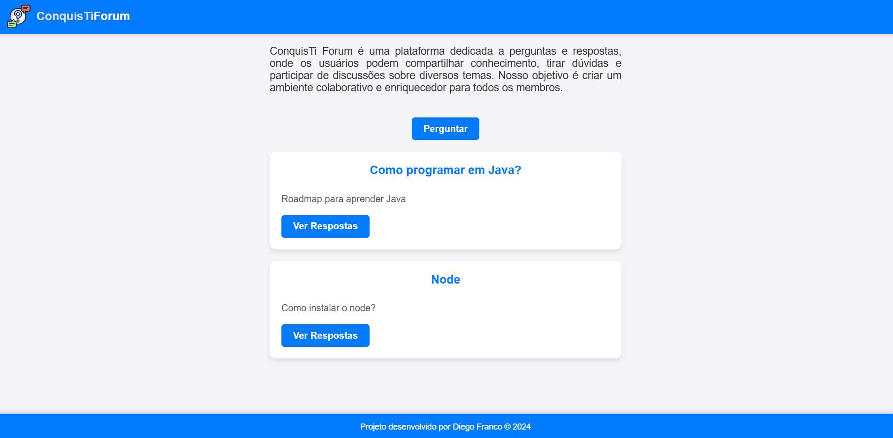

# ConquisTi Forum 
 

Este projeto implementa uma plataforma de perguntas e respostas utilizando Node, Express e MySQL.

 

## Interface
 

  

 

## Sumário

- [Tecnologias Utilizadas](#tecnologias-utilizadas)
- [Status](#status)
- [Descrição](#descrição)
- [Funcionalidades](#funcionalidades)
- [Explicação](#explicação)
- [Como Usar](#como-usar)
- [Autor](#autor)

 

## Tecnologias Utilizadas

 

  

    
  

  

    
  

  

    
  

 

## Status

 

## Descrição

É possivel responder uma pergunta e também ver as outras perguntas que foram relizadas.

 

## Funcionalidades

Responder perguntas, consultar respostas e realizar as próprias perguntas.

  

 

## Descrição

O ConquisTi Forum é uma plataforma de perguntas e respostas desenvolvida com **Node.js**, **Express** e **MySQL**. Este projeto tem como objetivo fornecer um ambiente onde os usuários podem compartilhar conhecimento, esclarecer dúvidas e participar de discussões sobre temas variados. A interface é intuitiva e permite que os usuários vejam as perguntas, respondam e façam novas perguntas facilmente.

 

## Funcionalidades

- **Página Inicial**: Lista todas as perguntas disponíveis no fórum, organizadas em ordem decrescente, mostrando título e uma breve descrição de cada pergunta.
- **Criar Pergunta**: O usuário pode criar uma nova pergunta com um título e uma descrição.
- **Responder Perguntas**: Na página de uma pergunta específica, é possível adicionar respostas. As respostas aparecem organizadas em ordem decrescente.
- **Visualizar Perguntas**: Cada pergunta tem uma página dedicada, onde o usuário pode ver a pergunta em detalhes e visualizar as respostas.
- **Divisões Visuais e Separações**: As seções são separadas por traços para melhorar a navegação visual.

## Explicação

Este projeto utiliza o **Sequelize** como ORM para manipulação de dados no banco de dados MySQL. As principais operações realizadas incluem:

- **CRUD** (Create, Read, Update, Delete): Operações básicas para criar, ler, atualizar e deletar dados no banco de dados.
- **Rotas**: O Express define rotas como `GET` e `POST` para permitir que os usuários naveguem, criem e respondam perguntas.
- **Modelos do Banco de Dados**: O Sequelize é configurado para criar e manipular modelos, como `Pergunta` e `Resposta`, que representam as tabelas do banco de dados.

## Autor

Desenvolvido por Diego Franco
